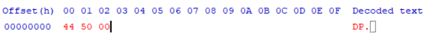

# local generated pay code - Specification v1-beta

## Goal / Preconditions

1. 통신이 없는 환경에서 결제 승인을 낼 수 있는 코드를 발급한다.
2. 결제는 키오스크에서 진행하며 키오스크는 인터넷 연결이 되어있다.
3. 코드는 포스와 아무 통신 없이 만들어져야 한다.
4. 한 번 사용된 코드는 다시 결제에 사용할 수 없다.
5. 코드는 만들 떄마다 완전히 새로운 값을 가져야 한다.
6. 생성된 코드는 30초 이내로 만료되어야 한다.
7. 결제코드 생성 알고리즘은 모두가 알고있다고 가정한다.
8. 결제 코드를 통해 카드 ID 등을 알아낼 수 없어야 하고, 이를 유도하여 결제 코드를 생산할 수 없어야 한다.
9. QR코드는 다음 조건으로 생성된다.
    - Error Correction Level: L
    - Maximum version: 13
    - base64 인코딩 결과를 사용한다.
    - Byte 모드로 인코딩 한다.

## Specification

### 1. Sign up

사용자 등록시 새로운 RAS 키 쌍을 만든다. 키 길이는 2048 bit.

### 2. Onboarding

사용자가 로그인후 새로운 device uuid와 함께 온보딩진행하면 서버는 사용자의 public key와 user uuid를 클라이언트에게 전달한다. 이때 클라이언트는 public key를 사용자 기기에 안전하게 저장한다.

### 3. 결제 수단 등록

1. 카드 정보 입력 후 서버는 빌링키를 발급하고 클라이언트에게 다음 값을 전달한다.
    - payment method id (MID): 카드마다 발급되는 고유 번호 (UUID)
    - OTP Secret (K): HMAC에 사용되는 secret key
    - payment method registered time(T0): 결제 수단이 등록된 시간 (Unix time)
    - OTP Interval(Tx): 카운터 갱신 주기 (default=30)

클라이언트는 인터넷 없이 결제가 가능해야하기 때문에 이 값들을 로컬에 안전하게 저장환다.

1-2. Legacy Register

이전에 등록된 카드의 Payment Method Registered Time은 오프라인결제 이용을 동의한 시각으로 한다.

#### Payment Method Id

모든 Payment Method Id는 중복되지 않는 값을 고유의 값을 가지고 있다. 같은 카드를 등록하더라도 Payment Method Id는 다른 값이 된다.

### 4. Generate Payment Code

결제 코드는 다음 세 부분으로 구성된다.

```text
Base64([Prefix][Algorithm version][user uuid]Encrypt([device uuid][MID][HMAC][Nonce]))
       [2 byte][     1 byte      ][ 16 byte ][                 256 byte              ]

base64(275 byte) → 368 chars in QR
```

이때 QR 코드에서 Byte mode는 문자열 하나당 8 bits 사용하므로 총 “2,944 bits”.

이는 QR version 13의 Error Correction Level이 L 일때 [최대 수용 가능 bit 수](https://www.qrcode.com/en/about/version.html) 2,960 bits 안에 포함된다.

- 왜 version 13인가?

    QR코드가 너무 커지면 안된다. 나는 그 한계선을 alignment의 개수가 최대 6개 까지 있는 QR로 정했고, version 13이 alignment가 6개인 마지막 QR 버전이다.

    만약 base64 인코딩 길이가 너무 길어지면 어떡할까? 이땐 base 64 인코딩을 하지 않고 binary값을 QR코드에 그대로 넣는것으로 길이를 줄일 수 있다. 지금도 base 64 인코딩을 하지 않는다면 2,200 bits만 사용하면 된다.  

- 왜 Error Correction Level을 L로 하는가?

    이는 말 그대로 QR코드 손상에 대처하기 위해 있는것이다. 우리에게 적용된다면 스크린이 박살난 기기에서 결제를 가능하게 해줄 수 있는 장치에 불과하다. 그리고 당연히 단계가 높을수록 저장할 수 있는 정보의 길이도 줄어든다. 따라서 L을 선택했다.

#### 1) Prefix

디미페이 결제 코드임을 나타내는 접두사.  hex값 `44 50`(DP)를 사용한다.

#### 2) Algorithm version

`00000 000(2)` (uint8)

알고리즘 버전은 첫 5bit를 major 버전, 다음 3bit를 minor 버전으로 관리한다.

따라서 major 버전은 32, minor버전은 8까지 표현가능하다.

00001 000 (0x8) → 1.0v

00011 001 (0x19) → 3.1v

- implementation
  - extract major version: `v >> 3` ex) `0x6D >> 3 = 13`
  - extract minor version: `v & 7` ex) `0x6D & 7 = 5`

버저닝 규칙

major 버전이 같고  minor버전이 다른경우, 결제 코드는 호환가능하다 → 앱 업데이트가 필요없음.

major 버전이 다른경우, 결제는 불가능하며, 앱 업데이트가 필요할 수도 있다.

major 버전이 32를 넘어가면 prefix를 변경하고 버전은 0.0v부터 다시 카운팅한다.

#### 3) User UUID, Device UUID & MID

UUID에서 `-`를 제거하여 사용한다.  `-`를 제거하여 저장해두어도 괜찮다.

ex) `c5d1a458-cb07-41e9-8545-9a5564ea0074` → `c5d1a458cb0741e985459a5564ea0074`

#### 4) HMAC

[HMAC](https://en.wikipedia.org/wiki/HMAC)은 결제 토큰의 만료일을 나타내는 역할을 한다.

1) Counter 계산

$$
C=\left\lfloor {\frac {T-T_{0}}{T_{X}}}\right\rfloor
$$

- T: 현재 Unix 시각 (클라이언트가 생성)
- T0: 결제수단 등록 시각 (서버에서 받은 값)
- Tx: 카운터 업데이트 주기 (서버에서 받은 값)

2) 해시 함수

해시함수는 SHA-256을 사용한다.

3) HMAC 계산

3rd party 패키지를 이용하는것을 권장한다. 직접 구현을 원한다면 [wik](https://en.wikipedia.org/wiki/HMAC) 잠고.

HMAC(K, C)

- K는 OTP Secret

#### 5) Nonce

한 번 결제에 사용된 코드를 다시 사용할 수 있게 하기 위해 nonce값을 사용한다.

uuid v4에서 `-`를 제거한 값.

#### 6) Encrypted Payment Code

키오스크는 결제를 진행하기 위해 결제 수단이 무엇인지만 알면 된다. 하지만, 이것을 바코드에 바로 노출할 순 없기 때문에 암호화를 진행한다.

암호화에 RSASSA-PSS를 사용한다.

- Key Size: 2048 bits
- Hash Algorithm: SHA-256
- MGF1 HashAlgorithm: SHA-256
- Salt Length: 32

## 예제

사용자 등록부터 결제 코드 생성까지의 데모이다. 서버와 클라이언트의 역할을 나타내기 위해 서버는 주황색, 클라이언트는 파란색을 사용한다.

### 1.  Sign up

Server는 2048 bits RSA 키를 생성한다.

- Public key

```text
MIIEvQIBADANBgkqhkiG9w0BAQEFAASCBKcwggSjAgEAAoIBAQCVsFlXqomSpRXwoKARrLyiNlYvA5AWuFkDCjpkDVwgMMZMCmANbkIz72eCgeDQUzF3DYal4wA2PaWKAodC6
```

- Private key

```text
MIIBIjANBgkqhkiG9w0BAQEFAAOCAQ8AMIIBCgKCAQEAlbBZV6qJkqUV8KCgEay8ojZWLwOQFrhZAwo6ZA1cIDDGTApgDW5CM+9ngoHg0FMxdw2GpeMANj2ligKHQuv/4RnrUfkYJFGWLm2B8NvXAN5Sro3OACRwcC3haW+apoI/y/4qCAPZy5qlE+dbFo7RXL7wAptsB8NEnqU2m9duCi8AW+lD2eQZWU+0BN+VsiOujoj5uXZpw2eB0fBhnQ+tNLy3734Ja8t+DitDLTV6gvYtXXF7XGH9UuW1YhCFt5ItzCUznD1yve5cmzP6tFRR0U+kQK4GPsiQpdZ+DqP/w0cb+xOYlzyQM3HSstOPmCwMOayMGbD7GVpBt8JUWyAyVQIDAQAB
```

### 2. Onboarding

클라이언트는 온보딩에서 새로운 device id(uuid)를 함께 보내고, 온보딩에 성공하면 서버는 public key와 user uuid를 전달한다.

- device uuid

```text
de08c6af-9da1-4720-b7da-2e8ff962510f
```

- user uuid

```text
f2b21e91-6d31-4724-a4fb-bef956440fce
```

### 3. 결제수단 등록

---

카드정보 입력 후 서버는 다음 값을 클라이언트에게 전달한다.

- payment method id (MID): `9fb961c8-187f-4b46-8f30-c76021cf3ed8`
- OTP Secret (K):  `GoQnxXeW+fjlzo7JSTVcwcDFxME=`
- payment method register time(T0): `1705896544745`
- OTP Interval(Tx): `30`

클라이언트는 해당 값들을 안전하게 저장한다.

### 4. Generate Payment Code

---

#### 1) Prefix

hex값 `44 50`을 사용한다.

#### 2) Algorithm version

hex값 `00`을 사용한다. (0.0v)

[지금까지의 코드]



#### 3) User UUID

user uuid에서 `-`를 뺸 값을 추가한다.

[지금까지의 코드]


#### 4) HMAC 생성

먼저 카운터를 계산한다. (T = `1705897217563`)

Math.floor((1705897217563 - 1705896544745) / 30) = `22427`

SHA-256 알고리즘을 사용하면 다음과같다.

```text
6e48fb06ddbe1e66cff7675f1010db12137b5175cf9eecba9200b15a856548d9
```

#### 5) Nonce 생성

uuid v4로 nonce값을 생성한다. nonce 역시 uuid의 `-`를 제거한다.

```text
bd3f28b163014ca4af8a802c482306f3
```

#### 6) 암호화

먼저 암호화 문자열을 연결한다.

[device uuid] [MID] [HMAC] [Nonce]

```text
de08c6af9da14720b7da2e8ff962510f9fb961c8-187f4b468f30c76021cf3ed86e48fb06ddbe1e66cff7675f1010db12137b5175cf9eecba9200b15a856548d9bd3f28b163014ca4af8a802c482306f3
```

Cipher type RSA/ECB/OAEPWithSHA-256AndMGF1Padding을 이용하여 암호화한다.

```text
6544350e411437d4f8d28cec9af3f39f1169015092c51c45e76dae6e4fc587cc18dcfa87674aa4f06c6ca7c930dc35946e096b7afff9031ee9240bc207349bbdeeef2468f5b6bbbf79876233e4cb5c02d3244b3ca86e8729a099c0d8ee0e0987ce40b6d3c0936cc0346835e242b439f6f3e213ad73c90c68707fd9d6cfba6bdd006e63226147b7c2a1ad6eb5a15433834fddaf506d83d8d3348208838229390db1ebf682f9e3483aa57387656bfbbbe52054c0f0cd20da3eccc55e6a7dfe40cb1aaec001f048fc6d5546273df1d88f69bbce5638f42adf52350bacf7e73491990d3a14617f08962c6d92afa9907c978f86682febbd64506f14ae3e15bbc24332
```

[지금까지의 코드]


#### 7) Base64 인코딩

```text
RFAA8rIekW0xRySk+775VkQPzmVENQ5BFDfU+NKM7Jrz858RaQFQksUcRedtrm5PxYfMGNz6h2dKpPBsbKfJMNw1lG4Ja3r/+QMe6SQLwgc0m73u7yRo9ba7v3mHYjPky1wC0yRLPKhuhymgmcDY7g4Jh85AttPAk2zANGg14kK0Ofbz4hOtc8kMaHB/2dbPumvdAG5jImFHt8KhrW61oVQzg0/dr1Btg9jTNIIIg4IpOQ2x6/aC+eNIOqVzh2Vr+7vlIFTA8M0g2j7MxV5qff5AyxquwAHwSPxtVUYnPfHYj2m7zlY49CrfUjULrPfnNJGZDToUYX8Ilixtkq+pkHyXj4ZoL+u9ZFBvFK4+FbvCQzI=
```

문자열 길이가 368이라는 것을 확인할 수 있다.

#### 8) QR 코드 생성

Error Correction Level을 L로 하고, byte모드로 QR코드를 생성한다.

.png)

---

## refs

- References

  - Dynamic Security Code Card: [https://www.securetechalliance.org/wp-content/uploads/Dynamic-Security-Code-Card-WP-Final-July-2020.pdf](https://www.securetechalliance.org/wp-content/uploads/Dynamic-Security-Code-Card-WP-Final-July-2020.pdf)
  - HOTP on Wikipedia: [https://en.wikipedia.org/wiki/HMAC-based_one-time_password](https://en.wikipedia.org/wiki/HMAC-based_one-time_password)
  - TOTP on Wikipedia: [https://en.wikipedia.org/wiki/Time-based_one-time_password](https://en.wikipedia.org/wiki/Time-based_one-time_password)
  - Dynamic Data Authentication: [https://www.openscdp.org/scripts/tutorial/emv/DDA.html](https://www.openscdp.org/scripts/tutorial/emv/DDA.html)
  - Reducing Payment Card Fraud by Shifting over to EMV Chip Technology: [https://www.cryptomathic.com/news-events/blog/reducing-payment-card-fraud-by-shifting-over-to-emv-chip-technology](https://www.cryptomathic.com/news-events/blog/reducing-payment-card-fraud-by-shifting-over-to-emv-chip-technology)

  - emv

    - EMV SAD on flylib: [https://flylib.com/books/en/4.365.1.88/1/](https://flylib.com/books/en/4.365.1.88/1/)
    - EMV DDA on openscdp: [https://www.openscdp.org/scripts/tutorial/emv/DDA.html](https://www.openscdp.org/scripts/tutorial/emv/DDA.html)

  - How toadd additional security layers? (refs)

    - **Zero-knowledge proof:** [https://en.wikipedia.org/wiki/Zero-knowledge_proof](https://en.wikipedia.org/wiki/Zero-knowledge_proof)
    - **Non-interactive zero-knowledge proof:** [https://en.wikipedia.org/wiki/Zero-knowledge_proof](https://en.wikipedia.org/wiki/Zero-knowledge_proof)
    - **Zero-knowledge password proof:** [https://en.wikipedia.org/wiki/Zero-knowledge_password_proof](https://en.wikipedia.org/wiki/Zero-knowledge_password_proof)
    - **New Techniques for Non-interactive Zero-Knowledge**: [https://inst.eecs.berkeley.edu/~cs276/fa20/notes/New Techniques for NIZK.pdf](https://inst.eecs.berkeley.edu/~cs276/fa20/notes/New%20Techniques%20for%20NIZK.pdf)
